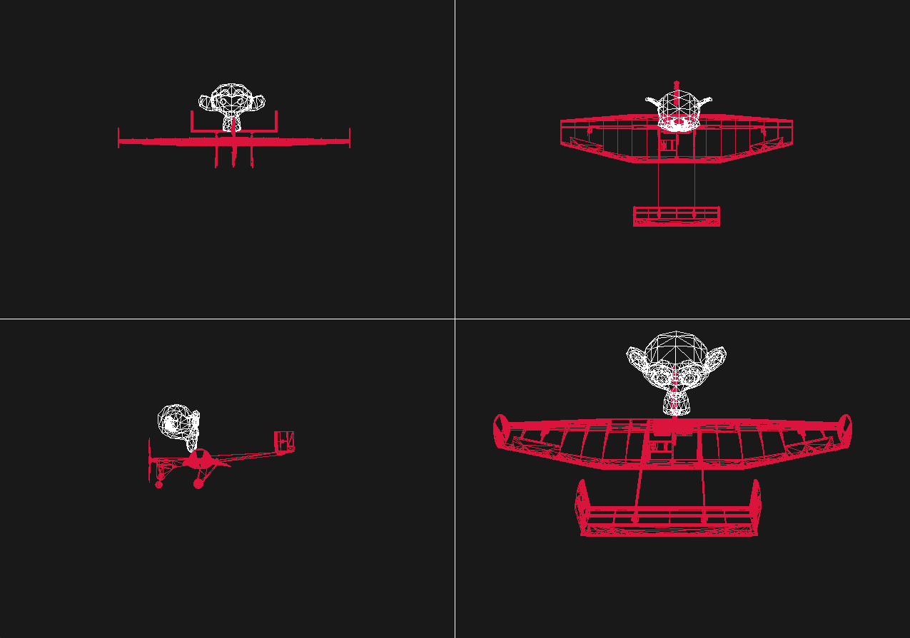

# 📐 MiniCAD

**MiniCAD** is a custom computer graphics project developed in C++ using the DirectX 12 API. It serves as a foundational application for rendering and interacting with multiple 3D objects and geometries. 

The project leverages a robust engine architecture, handling graphics pipelines, vertex and index buffers, and constant buffers to manage real-time rendering of complex scenes[cite: 4].

## 🖼️ Project Preview

  

## ✨ Key Features

- **Custom Graphics Engine**: Built from the ground up to support DirectX 12 rendering pipelines, including resource allocation and command list management[cite: 4].
- **Geometry Management**: Modular architecture for handling various 3D primitives and mesh data structures[cite: 4].
- **Pipeline Abstraction**: Implements a clean separation between application logic and graphics state management, including support for custom root signatures and pipeline states[cite: 4].
- **Camera Controls**: Features an orbit camera implementation, allowing users to inspect objects from multiple angles and zoom levels[cite: 4].

## 🛠️ Technical Stack

- **Language**: C++
- **Graphics API**: DirectX 12 (D3D12)
- **Tooling**: Visual Studio 2022
- **Shaders**: HLSL (Vertex and Pixel shaders)

## 🚀 Getting Started

### Prerequisites
- Visual Studio 2022
- Windows SDK (latest version recommended)
- A GPU that supports DirectX 12

### Building the Project
1. Clone the `joas-barros/minicad` repository[cite: 4].
2. Open the `Multiple.sln` solution file located in the project root[cite: 4].
3. Ensure the project is configured for your desired platform (x64 recommended).
4. Build the solution and run the application.

## 📂 Project Structure

- `Multiple/`: Contains the core application source code, including `Engine`, `Graphics`, `Geometry`, and `Camera` implementations[cite: 4].
- `Resources/`: Includes assets such as textures and icons used by the renderer[cite: 4].
- `Shaders/`: Contains the HLSL source files for rendering[cite: 4].

---
*Developed as part of the Computer Graphics course.*